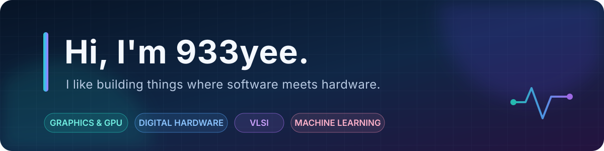

  

   

  
  
  

## About me

I'm a developer from NTHU who enjoys building across the boundary between software and hardware—from real-time rendering and GPU compute to FPGA systems, VLSI automation, and machine learning.

- 🎨 Exploring **computer graphics, rendering, and game technology**
- ⚡ Writing **compute shaders** in Unity and Unreal Engine
- 🔧 Building **digital systems and FPGA projects** with Verilog
- 🧩 Solving **VLSI physical-design and manufacturability** problems in C++
- 🧠 Experimenting with **deep learning and natural-language processing**

## Toolbox

  

Also working with **Verilog/SystemVerilog · OpenGL · GLSL/HLSL · SystemC · SPICE · Cadence EDA tools**.

## Featured projects

| Project | What it is | Built with |
| --- | --- | --- |
| 🎮 [FPGA Tetris](https://github.com/933yee/Verilog_Tetris) | A complete Tetris game with VGA output, PS/2 controls, hold/ghost pieces, scoring, and PWM music on a Basys 3 FPGA. | Verilog, Vivado |
| 🐟 [UE5 Compute Shader](https://github.com/933yee/UE5_ComputeShader) | An Unreal Engine global compute-shader plugin using RDG textures to drive a large instanced scene on the GPU. | UE 5.3, C++, HLSL |
| ✨ [Unity Compute Shaders](https://github.com/933yee/Unity_Compute_Shader) | Procedural render textures and a comparison of CPU, GPU-readback, instanced, and GPU-resident object animation. | Unity, C#, HLSL |
| 🕹️ [Arduino Game Controller](https://github.com/933yee/Arduino_Game_Controller) | A motion-aware Arduino controller connected to a collection of Unity games over a custom serial protocol. | Arduino, MPU6050, Unity |
| 🌄 [Graphics Programming](https://github.com/933yee/NTHU_Graphics_Programming_and_Applications) | Real-time rendering work including post-processing, GPU culling, deferred shading, SSAO, bloom, and volumetric lighting. | C++, OpenGL, GLSL |
| 🧱 [VLSI Physical Design Automation](https://github.com/933yee/NTHU_VLSI_Physical_Design_Automation) | Educational implementations of partitioning, floorplanning, analog placement, and standard-cell legalization algorithms. | C++, OpenMP, EDA |

<strong>More course projects</strong>

 

- [Deep Learning Competitions](https://github.com/933yee/NTHU_Deep_Learning) — LightGBM feature engineering, YOLOv1 object detection, and text-to-image generation
- [Natural Language Processing](https://github.com/933yee/NTHU_Natural_Language_Processing) — embeddings, character LSTMs, multi-label BERT, and RAG
- [Computer Graphics](https://github.com/933yee/NTHU_Computer_Graphics) — transformations, lighting, and texture mapping in OpenGL
- [Hardware Security](https://github.com/933yee/NTHU_Hardware_Security) — ring-oscillator PUFs, AES Trojans, NoC fault injection, and ECC
- [Integrated Circuit Design](https://github.com/933yee/NTHU_Integrated_Circuit_Design) — transistor-level CMOS, custom layout, NoC analysis, and compute-in-memory
- [VLSI Design for Manufacturability](https://github.com/933yee/NTHU_VLSI_Design_for_Manufacturability) — lithography-aware algorithms and power-staple insertion

## GitHub snapshot

  <picture>
    <source media="(prefers-color-scheme: dark)" srcset="https://github-profile-summary-cards.vercel.app/api/cards/stats?username=933yee&theme=github_dark">
    <source media="(prefers-color-scheme: light)" srcset="https://github-profile-summary-cards.vercel.app/api/cards/stats?username=933yee&theme=github">
    
  </picture>
  <picture>
    <source media="(prefers-color-scheme: dark)" srcset="https://github-profile-summary-cards.vercel.app/api/cards/repos-per-language?username=933yee&theme=github_dark">
    <source media="(prefers-color-scheme: light)" srcset="https://github-profile-summary-cards.vercel.app/api/cards/repos-per-language?username=933yee&theme=github">
    
  </picture>

  Always curious about how things work—from pixels on a screen to transistors on silicon.

